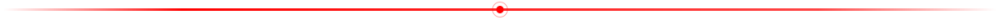
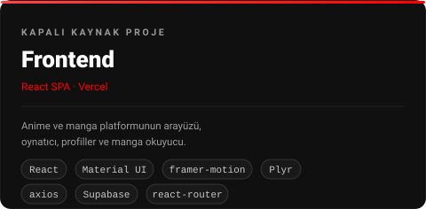
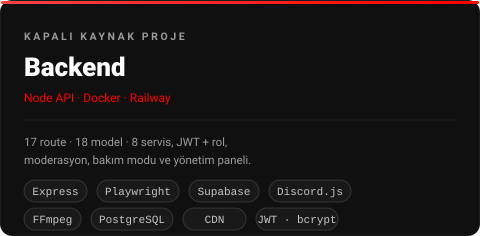
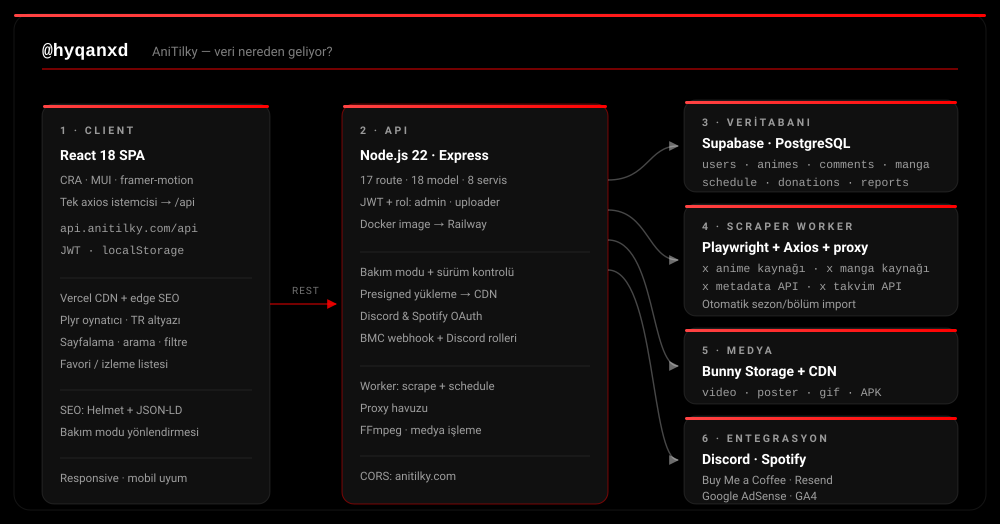

  

<table>
  <tr>
    <td width="53%" valign="top">

<h3>👋 Hakkımda</h3>

Merhaba, ben **hyqanxd**. Anime ve manga odaklı bir platformun (**AniTilky** → [anitilky.com](https://anitilky.com)) frontend'ini, backend'ini ve veri toplama katmanını baştan sona geliştiriyorum.

- 🔴 **Kurucu + tam yığın geliştirici** — React arayüz, Node.js API, PostgreSQL veri katmanı
- 🕷️ **Scraper & otomasyon** — Playwright/Axios tabanlı içerik toplayıcılar, proxy havuzu, otomatik sezon/bölüm import'u
- ☁️ **Altyapı** — Docker + Railway (API), Vercel (arayüz + SEO edge), CDN (medya dağıtımı)
- 🛡️ **Auth & yönetim** — JWT, rol hiyerarşisi (admin · superadmin · uploader), moderasyon ve bakım modu
- 💬 **Topluluk** — Discord bot ile doğrulama, destek talepleri ve rol yönetimi

**Şu an üzerinde çalıştıklarım**

- Yeni bölüm import pipeline'ı ve yayın takvimi senkronizasyonu
- Mobil istemci (Android) ve profil deneyimi
- Performans: liste sayfalama, önbellek stratejileri, medya yükleme akışları

<h3>🧰 Teknolojiler</h3>

  
  
  

    </td>
    <td width="47%" valign="top">

    </td>
  </tr>
</table>

<h3>🚀 Projelerim (kapalı kaynak)</h3>

<table>
  <tr>
    <td width="50%" valign="top">
      
      
React arayüz · Vercel

    </td>
    <td width="50%" valign="top">
      
      
Node.js API · Docker · Railway

    </td>
  </tr>
</table>

<h3>🧭 Veri nereden geliyor?</h3>

  

  

